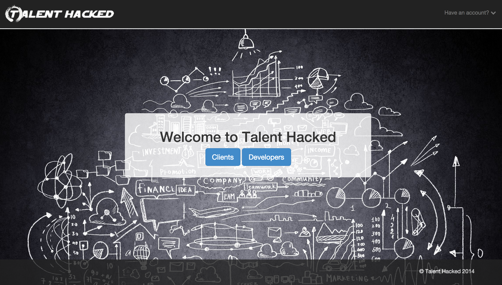

#Talent Hacked

##Table of Contents

* [Screenshot](#screenshot)
* [General Description](#general-description)
* [See it Live on Heroku](#see-it-live-on-heroku)
* [Browsers](#browsers)
* [Testing](#testing)
* [The team](#the-team)


##Screenshot

<a href="https://raw.githubusercontent.com/nadavmatalon/Talent_Hacked_Code/master/app/assets/images/talent_hacked_screenshot.png">
	
</a>


##General Description

<p><strong>Talent Hacked</strong> is a [Ruby on Rails](http://rubyonrails.org/) 
app written jointly by a team of 7 students at 
[Makers Mcademy](http://www.makersacademy.com/) 
as our final project.

The aim of the __Talent Hacked__ is to bring together clients seeking medium-size 
software solutions on the one-hand and freelance developers on the other.

By gathering detailed information from both clients (project requirements, budget, 
timeline, etc.) and developers (previous experience, programming skills etc.), the
idea is to create a pool of developers which can then be seamlessly matched to 
clients' projects based on their projects' needs.

Given the relatively large and inexperienced nature of [The team](#the-team) 
developing the app, much of the focus during the 2 weeks of development
was directed at learning to produce effective collaborative work and completing 
the first itteration of the app.

The app was developed using [TDD](http://en.wikipedia.org/wiki/Test-driven_development) 
(tests written with [Rspec](http://rspec.info/) &amp; 
[Capybara](https://github.com/jnicklas/capybara)). 

It uses a [PostgreSQL](http://www.postgresql.org/) database, as well as the 
following gems: 

* [Devise](https://github.com/plataformatec/devise)
* [Omniauth2](https://github.com/intridea/omniauth-oauth2)
* [Bootstrap](http://getbootstrap.com/)
* [Amazon S3](http://aws.amazon.com/s3/)
* [Paperclip](https://github.com/thoughtbot/paperclip)


##See it Live on Heroku

A live version of the app can be found at:

http://talent-hacked.herokuapp.com/

As we're using Heroku's free hosting service, the app may take a bit of time to upload<br/>
(Heroku's giros take time to wake up...), so please be patient.


##Browsers

 This app has been tested with and supports the following browsers:

* __Google Chrome__ (36.0)
* __Mozilla Firefox__ (31.0)
* __Apple Safari__ (7.0.5) (see note below)


##Testing

Tests were written with Rspec (3.0.3) &amp; Capybara (2.4.1)

The tests cover both back-end logic and front-end functionality.

To run the tests in terminal: 

```bash
$> cd Talent_Hacked_Code
$> rspec
```

##The Team

<a href= "https://github.com/frism">
	
</a>
[Faezrah Rizalman](https://github.com/frism)

<a href= "https://github.com/katehamilton247">
	
</a>
[Kate Hamilton](https://github.com/katehamilton247)

<a href= "https://github.com/JoshFB/">
		
	</a>
[Josh Fail-Brown](https://github.com/JoshFB/)

<a href= "https://github.com/fitstek">
		
	</a>
[Fitsum Teklehaimanot](https://github.com/fitstek)

<a href= "https://github.com/painted">
		
	</a>
[Will Allen](https://github.com/painted)

<a href= "https://github.com/jchb9">
	
<a>
[Johann Bornman](https://github.com/jchb9)

<a href= "https://github.com/nadavmatalon">
</a>
[Nadav Matalon](https://github.com/nadavmatalon)

